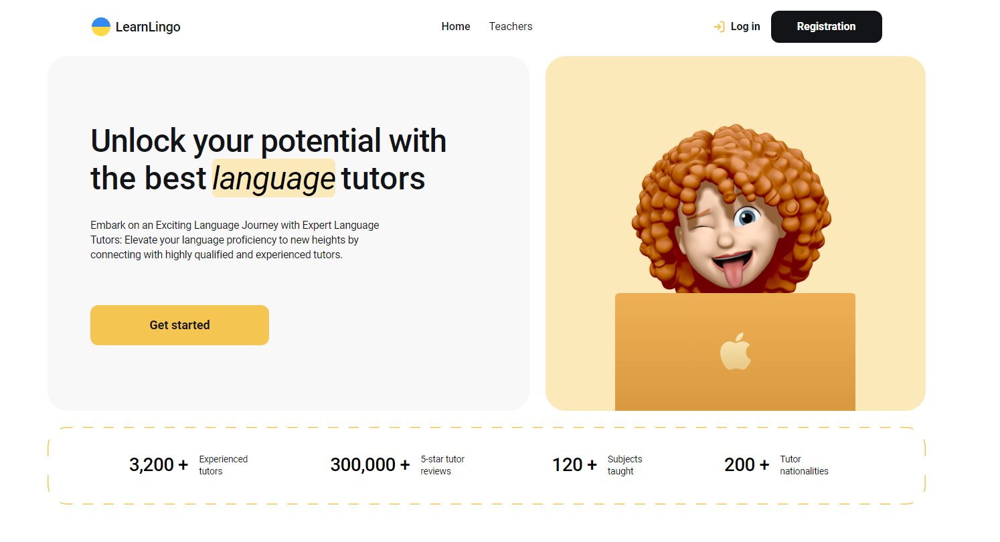
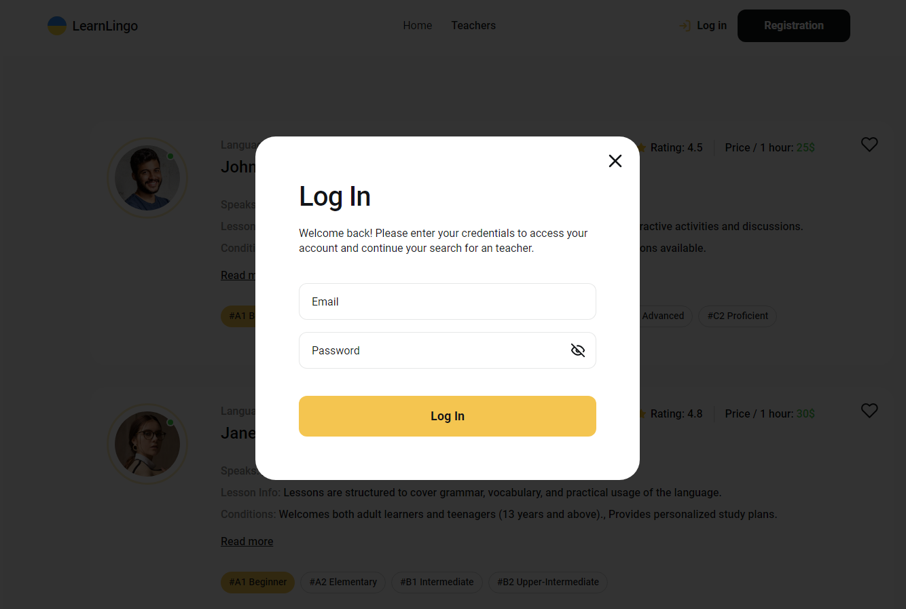
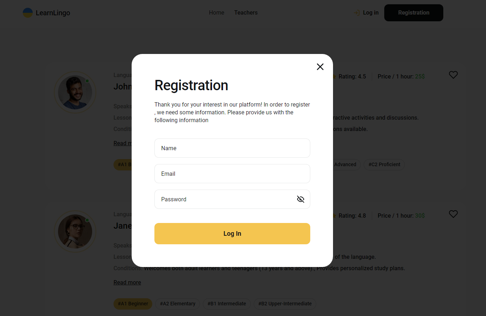
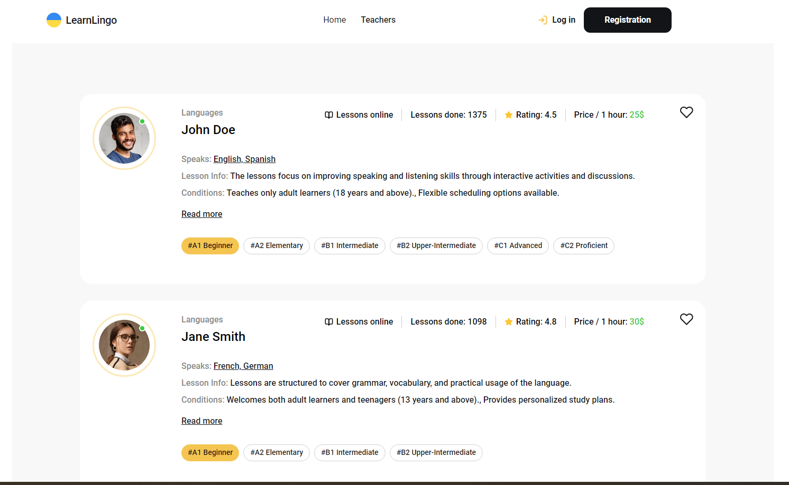

# App “Learn Lingo”
The Learn-Lingo project was created to make it easier to find a language tutor. The application has everything you need to find a quick and high-quality tutor.
The application was created using [Create React App]
  

The application organizes authorization using Firebase Authenticate.

The teacher card database was created with the help of Firebase Realtime Database

Organized pagination of teacher cards on the page, refreshing user, modal window for ordering a teacher. Layout from 320x to 1440x rubber. The work was done on React using the Vite bundler
